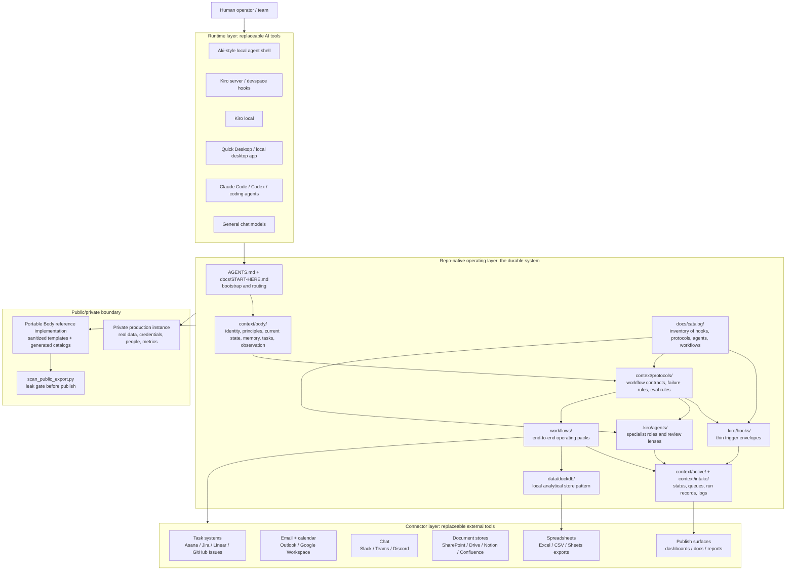

# System Map — Portable AI Operating Layer

This map shows the public, vendor-neutral version of the private operating system pattern. The goal is not to run one exact app. The goal is to keep the operating layer in a repo that many tools can read, modify, test, and execute.

## Visual map

## Read the map in four passes

1. **Runtime pass:** Aki, Kiro, Quick Desktop, Codex, Claude Code, Antigravity, and chat models are execution surfaces. None of them is the source of truth.
2. **Repo pass:** the repo is the operating layer. It stores memory, protocols, hooks, agents, workflow packs, state contracts, and local analytics schemas.
3. **Connector pass:** Asana, Outlook, Slack, SharePoint, Excel, DuckDB, and similar systems are connector categories. They are allowed public concepts; real IDs/data are not.
4. **Boundary pass:** private production content stays private. Public examples preserve structure, rationale, and workflow logic without copying sensitive state.

## Why this matters

AI tools move quickly. If your operating system lives inside one app, it breaks when the app, model, connector, or runtime changes. If the operating system lives in a repo with explicit protocols and capability contracts, a new tool can load the repo and continue the work.
